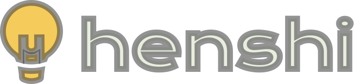
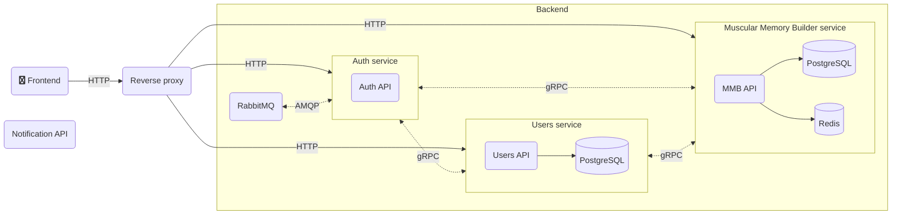

    
    
Building better memory, one click at a time.

## About

Henshi is a webapp based on microservices architecture, it uses Vue.js as its primary frontend framework and Nest.js on the backend.

## Features

- [PostgreSQL](https://postgresql.org) as its SQL database
- [Redis](https://redis.io) as cache and key-value database
- [Nginx](https://nginx.org) as a reverse proxy
- [gRPC](https://grpc.io) as an synchronous method of communication between the services (🚧 **In progress**)
- [RabbitMQ](https://rabbitmq.com) as an asynchronous method of communication between the services (🚧 **In progress**)
- [Docker](https://docker.com) as its container management tool 
- [Kubernetes](https://kubernetes.io) as its container orchestration tool (🚧 **In progress**)
- [Github Actions](https://github.com/features/actions) as its CI/CD platform (🚧 **In progress**)

## Architecture

## Development

See [DEVELOPMENT.md](DEVELOPMENT.md).
